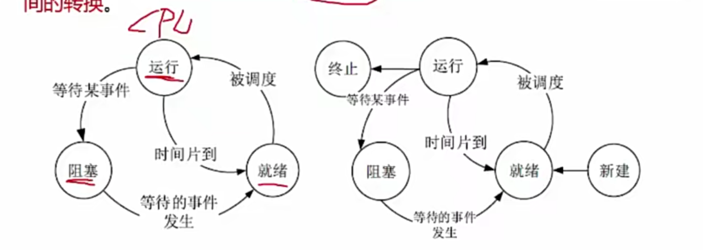
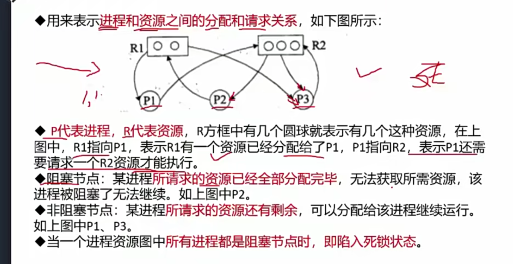
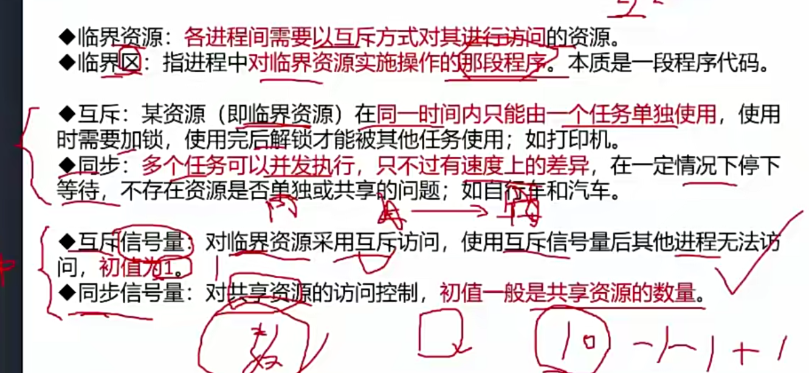

# 组成
    1.PCB（进程控制块）
    2.程序
    3.数据

# 三态
    1.运行
    2.阻塞
    3.就绪  

# 进程资源

# 进程同步与互斥

    
- p操作:申请资源
- v操作：释放资源

# 进程调度
- 剥夺分类
    1. 可剥夺
    2. 不可剥夺
- 调度分类
    1. 高级（进入输入池）
    2. 中级（调入内存，参与竞争）
    3. 低级（占用cpu）
   
- 调度算法
    1. 先来先服务
    2. 时间片轮转
    3. 优先级调度
    4. 多级反馈调度